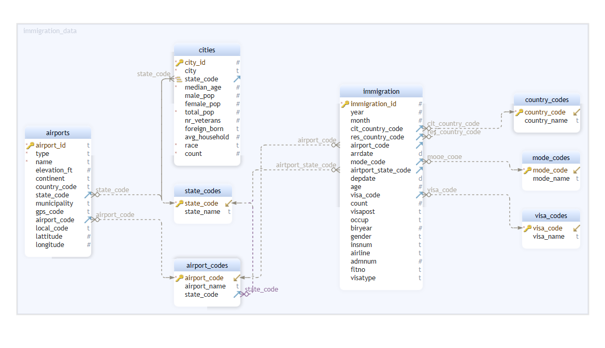

# Data Engineering Nanodegree Capstone Project
This is the final project for Udacity's Data Engineering Nanodegree. The Udacity provided project was used for this setup. The goal of the project is to create a database star schema for analysis purposes of the immigration data. The focus of this analysis is to investigate the differences per state. The database is created and filled (and deleted for saving resources) in Redshift.

## Data
The Udacity provided project consists of four datasets:

- **I94 Immigration Data**: this data contains the US immigrations of April 2016. A data dictionary was also provided.
- **World Temperature Data**: this data contains temperature measures from all over the world from 1743 to 2013. This dataset is **not used** since it has no overlap with the immigration data.
- **U.S. City Demographic** Data: this data contains demographic information about US cities.
- **Airport Code Table**: this data contains information about different airports from all over the world.

The data dictionary of the immigration data is split up into 5 text files:
- **I94addrl**: this contains a list of US states (code and name).
- **I94cntyl**: this contains a list of countries (code and name).
- **I94model**: this contains a list of travel modes (code and name).
- **I94prtl**: this contains a list of airports (code, name and state).
- **I94visa**: this contains a list of visa types (code and name).

For the sake of this project, let's assume the data is already gathered from different sources and uploaded to an S3 bucket. This is called our raw data.

## ETL
Airflow is used to process the multiple stages of the ETL pipeline. Three DAGs were created for three different purposes. 

The first DAG uses Pandas functions to clean the CSV and Text data and store it back on S3. The second DAG uses an EMR cluster with Spark to clean the SAS data and save it as Parquet files back on S3.

The third DAG creates a Redshift cluster and a connection to the cluster. Thereafter it creates (staging) tables and copies the clean data from S3 to these tables. Next, it loads the staging data into fact and dimension tables. Finally, it performs data quality checks.


### Cleaning
Since all numeric values of CSV and SAS files are read as doubles, for every file all columns that should be integers are converted. Also, the following cleaning steps were taken:
- **I94 Immigration Data**: for this data the `arrdate` and `depdate` are in SAS date numeric format and converted to date type.
- **Airport Code Table**: this data is first filted on US airports, because we are only interested in US data. Next, the `latitude` and `longitude` are split from the `coordinates` column as well as the `state` from the `iso_region`.
- **I94prtl**: for this data the `state` is split from the `airport_name` column.

Not specifically during the cleaning phase, some columns are filtered from the immigration data as they are not required for the analysis goal.

### Data quality
Two data quality checks are performed. One is to check if the tables are created correctly and the other one is to check if data exists in these tables indicating that the data loading is performed succesfully.

## Schema
In the final schema the immigration table is a fact table while the others function as dimension tables. The `state_codes` table functions as the link between the immigration data and the airport and cities data. This way analysis between states based on immigration data can be performed, while airport and city data add extra information.



## Scenarios
#### *What if the data was increased by 100x?*
Let's assume that this increase only applies to the immigration data, since the number of cities and airports will likely not increase. In this scenario Spark and Airflow will be our best friends. Spark can handle the 100x more data quite easily if we add an appropriate number of slave nodes to the EMR cluster. For loading the data in Redshift Airflow would need a schedule for running the ETL pipeline. This way we can load in the data bit by bit e.g., daily.

#### *What if the pipelines would be run on a daily basis by 7 am every day?*
For this scenario we would use a daily schedule in Airflow running at 7 am.

#### *What if the database needed to be accessed by 100+ people?*
By using Redshift we already tackled this problem a bit, but it needs efficient data distribution to make sure the data remains quickly accessible for everyone. Currently the immigration data has a `DISTKEY` on the `immigration_id` column, because we only use one month of data in this project. If the data would be supplemented with more months of data, the `DISTKEY` should be set on `year` and `month`.

## Running the project
If you want to run this project yourself, you will need to install Docker, since the Airflow Docker variant is used. Also you will need to create a `.env` file and add your AWS credentials, your region and an Airflow UID there, like so:
```
AIRFLOW_UID=1000
AWS_ACCESS_KEY_ID=<key>
AWS_SECRET_ACCESS_KEY=<secret>
REGION=<region>
```

Next, simply run:
```
docker-compose up
```
It will first get the image and build the containers. Thereafter, it starts the containers and you can open the webserver on `localhost:8080`. On the webserver you can start the three DAGS.

It could be that the `clean_sas_data` DAG doesn't perform as expected. In that case you can run the `/dags/scripts/clean_sas_data.py` script locally. This requires an installation of `pyspark` though.